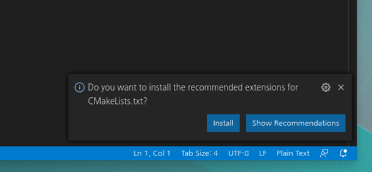
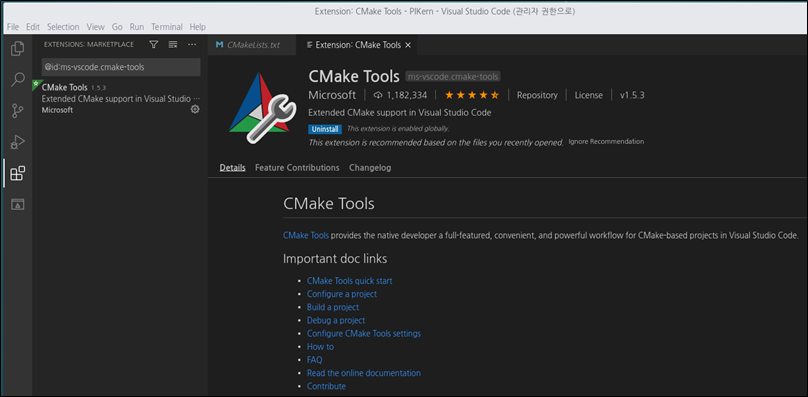
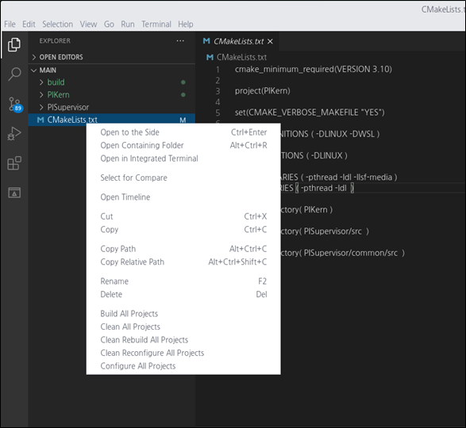
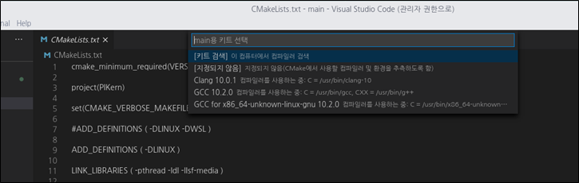
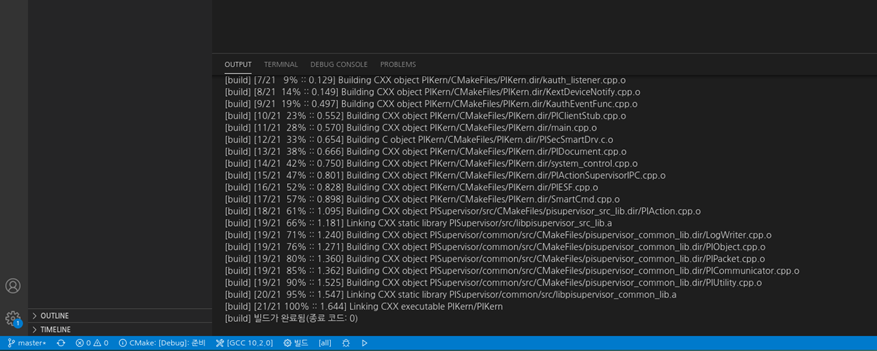
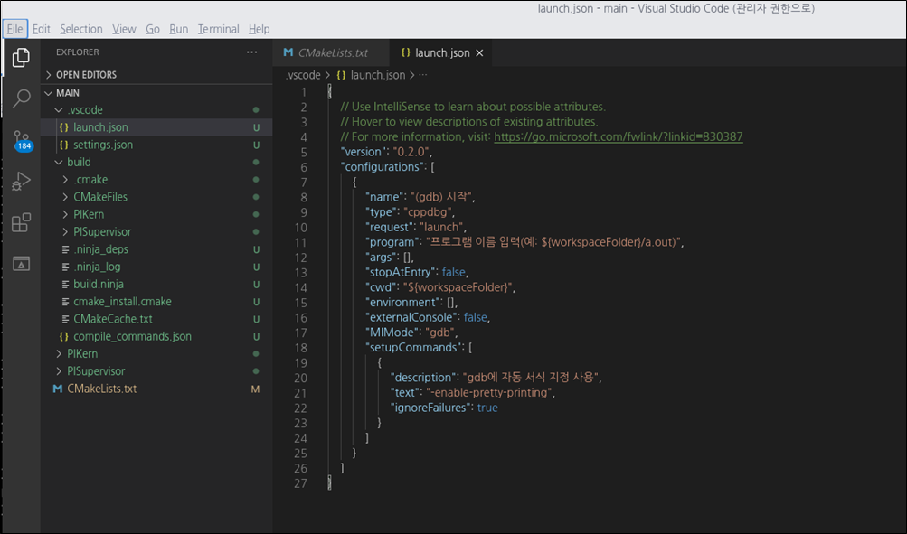
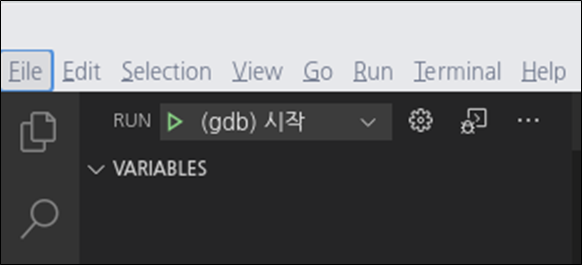
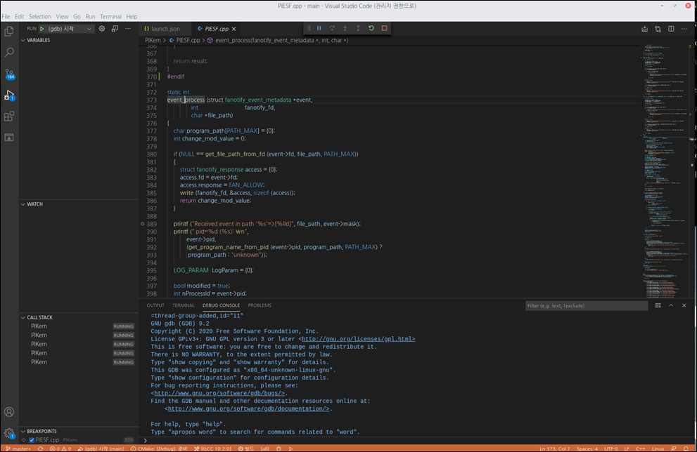

# endpointdlp

개방형OS에서의 엔드포인트 정보유출방지(Endpoint DLP) 보안 소프트웨어

## 프로젝트 소개
-------------------
본 오픈소스 프로젝트는 개방형OS 환경에서 정보유출방지 기능을 제공하기 위한 보안 소프트웨어입니다. 정보유출방지(DLP, Data Loss Prevention)는 조직내 기밀정보가 외부로 유출되는 것을 방지하는 정보보호 솔루션이며, 디바이스에 저장된 기밀정보를 검출하거나, 이동식 저장매체 또는 출력물, 네트워크 전송을 통해 유출되는 기밀정보를 탐지하여 조직의 자산을 보호할 수 있습니다.

## 프로젝트 기여하기
--------------------
프로젝트에는 다음의 방법으로 참여할 수 있습니다.
* 버그 리포트
* 수정사항 제출
* 새로운 기능 제안
* 문서
* 자세한 내용은 [Contributing Guide](https://github.com/somansa-oss/endpointdlp/blob/master/CONTRIBUTUNG.md)를 참고하시기 바랍니다.

## 프로젝트 정보
----------
* 개발 언어: C
* 개발 환경: VSCode
* 라이선스: Apache 2.0
* 문의사항: 소만사 이상진 수석연구원(sjinlee@somansa.com)
* 커뮤니케이션 채널

  -> [Slack 채널 가입 링크](https://join.slack.com/t/somansa-opensource/shared_invite/zt-ikibhul1-PT~Z9R9w5xrEA8LT_pyuDg)
    
  -> Google Groups: sjinlee@somansa.com 으로 메일 주시면 초대장을 보내드립니다. 

## Getting Started
----------
아래와 같이 git 명령을 수행하여, 소스를 내려 받습니다

> $ git clone https://github.com/somansa-oss/endpointdlp.git

소스 clone이 끝나면, 아래와 같이 endpointdlp 라는 폴더가 생성되었음을 확인할 수 있습니다.

이제 소스를 내려 받았다면, 다음 단계로 아래와 같이 개발환경을 설정할 수 있습니다.

### 개발도구 설치
---------
> * 권장 개발환경: Visual Studio Code / CMake / gdb

개방형OS에서 개발을 하기 위해서, 다양한 IDE 프로그램들이 있으나, 그 중에서 본 프로젝트에서 권장하는 것은 MS에서 만든 Visual Studio Code입니다. 
다른 IDE 도구들에 비해 다양한 장점이 있지만, 가장 마음에 드는 것은 역시 사용자(개발자)를 위한 기본 기능에 충실하다는 점입니다.
특별히, CMake를 이용하여, 개방형OS 뿐 아니라 다른 OS환경 ( Windows, MacOS) 에서 동시에 빌드 가능한 빌드 시스템 구축이 가능할 뿐 아니라, gdb와 함께 런타임 디버깅이 가능하다는 것이 무엇보다도 편리합니다.

Visual Studio Code ( 이후 Code )를 설치하는 가장 간단한 방법은 구름OS에서 제공하는 “소프트웨어 센터”에서 Code를 선택하여, 설치하는 방법입니다. 
카테고리로 개발자 도구를 선택하면, 다음과 같이 Code를 확인할 수 있습니다.

위의 Visual Studio Code를 클릭하면, 설치가 시작됩니다. 이제 다음 단계로 실제 프로젝트를 열어서, 빌드하는 과정에 대해서 살펴보겠습니다.

### 소스 빌드
---------
소스 빌드를 위해서는, 앞서 설치한 code를 실행하고, 메뉴 중에서 File > Open Folder 를 클릭하여 폴더를 열면 됩니다. 

본 프로젝트에서는 아래와 같이 PIKern 및 PISupervisor의 2개 하위 모듈로 구성됩니다. 각 모듈을 빌드하기 위해서는, 각 모듈에 해당하는 폴더를 open하면 됩니다.

| 모듈 이름 | 폴더 위치 | 비고 | 
| :------------: | :----------- | :------------------- | 
| PIKern | endpointdlp/main | 커널 통제 모듈 |
| PISupervisor | endpointdlp/main/PISupervisor | 커널 통제 인터페이스 모듈 |

이제부터는 위의 2개 모듈 중에서 PIKern을 기준으로 빌드 과정을 살펴보도록 하겠습니다. 앞서 살펴본 바와 같이, 폴더 endpointdlp/main 을 선택하고, “확인” 버튼을 클릭합니다.

이제 다음 단계로 CMake 를 이용한 빌드 과정에 대해서 살펴보겠습니다. 아마도, 앞서 main 폴더를 선택하여, 새로운 프로젝트를 생성하였다면, 대부분의 경우 아래와 같이 CMake 플러그인 설치를 권유하는 창이 뜨게 됩니다.
 
 

여기서 Install 버튼을 클릭하면, 아래 그림과 같이 Visual studio code용 CMake 플러그인 설치 페이지 화면이 나오게 됩니다. 만약, 아래와 같은 CMake 설치 페이지 화면이 나오지 않는다면, 이미 CMake 플러그인이 설치된 경우이나, 아래 단계를 skip 해도 좋습니다. 단, 아래 화면과 같이 CMake 플러그인 설치 페이지 화면이 나온다면, 아래 화면에서 Install 버튼을 클릭합니다. 
 

Install 버튼을 클릭하면, CMake 플러그인이 설치가 됩니다. 그리고, 설치가 정상적으로 완료되었다면, 아래 그림과 같이 설치 완료 화면이 나오게 됩니다.

이제 정말로 빌드를 해볼까요? 아래 그림과 같이 왼쪽 Pane의 CMakelists.txt 파일을 선택한 뒤, 오른쪽 마우스 클릭을 하면, 메뉴가 보입니다. 여기서 “Build All Projects”를 선택해 봅시다.

단, 이렇게 Build 명령을 실행시켜도, 빌드가 막바로 시작되지 않고, 아래 그림과 같이 컴파일러를 선택해야 합니다. 여기서는 “GCC 10.2.0” 을 선택하도록 하겠습니다.
 

컴파일러가 선택되면, 빌드가 시작됩니다. 빌드가 성공적으로 끝났다면, 아래와 같이, 결과 Output 화면에 빌드 성공을 확인할 수 있습니다.

### 모듈 설치 및 실행
---------
앞서 빌드한 모듈을 실행 경로 “/usr/local/Privacy-I”로 복사합니다. 아마도 대부분의 PC에서는 아래 디렉토리가 없기 때문에, 아래와 같이 mkdir 명령을 이용하여 새로 디렉토리를 만듭니다. 여기서 /usr/local 디렉토리 하위에 생성하기 때문에 sudo 를 이용했습니다.

> $ sudo mkdir /usr/local/Privacy-i

이제 앞서 빌드한 2개의 모듈을 복사합니다. 단, 여기서는 다운로드 받은 원래 소스의 위치가 ~/opensource/endpoint 라고 가정하였습니다.

> $ sudo cp ~/opensource/endpointdlp/main/build/PIKern/PIKern    /usr/local/Privacy-I

> $ sudo cp ~/opensource/endpointdlp/main/PISupervisor/build/PISupervisor    /usr/local/Privacy-i

모듈 복사가 성공했으면, 아래와 같이 명령을 수행하여, 각각 모듈을 실행시킬 수 있습니다. 먼저, 아래는 PIKern을 실행시키는 명령입니다.

> $ cd /usr/local/Privacy-I

> $ sudo PIKern

다음은 PISupervisor를 실행시키는 명령입니다. 단, 두개 모듈을 실행시키는 순서는 PIKern  PISupervisor 입니다. 순서를 지켜서 실행시켜야 합니다.

> $ cd /usr/local/Privacy-I

> $ sudo PISupervisor

* PISupervisor 모듈을 실행시켰을 때, 오류 메시지가 나오는데, 무시 가능하며, 곧 수정 예정입니다.

### 런타임 디버깅
---------
개방형OS에서 Visual Studio Code를 이용하면, 실행중인 프로세스를 디버깅하는 런타임 디버깅 환경이 지원됩니다. 메뉴 중에서 Run > Open Configuration 을 클릭합니다. 그러면, 아래와 같이 실행 및 디버깅 환경을 셋팅할 수 있는 launch.json 파일이 보입니다.

 

이 파일의 내용을 아래와 같이 수정해 주세요. 여기서 중요한 것은 program에서 실제 현재 빌드 환경의 경로를 정확하게 입력해야 한다는 점입니다. /home/somansa/opensource 디렉토리 밑에 소스를 내려 받아서 빌드한 예입니다. 이 경로는 소스 저장 위치에 따라서 적절하게 수정이 필요합니다.

    
    {
        "version": "0.2.0",
        "configurations": [
            {
                "name": "(gdb) 시작",
                "type": "cppdbg",
                "request": "launch",
                "program": "/home/somansa/opensource/endpointdlp/main/build/PIKern/PIKern",
                "args": [],
                "stopAtEntry": false,
                "cwd": "${workspaceFolder}",
                "environment": [],
                "externalConsole": false,
                "MIMode": "gdb",
                "miDebuggerServerAddress": "127.0.0.1:8844",
                "setupCommands": [
                    {
                        "description": "gdb에 자동 서식 지정 사용",
                        "text": "-enable-pretty-printing",
                        "ignoreFailures": true
                    }
                ]
            }
        ]
    }

아울러, 런타임 디버깅을 위해 gdbserver를 이용했습니다. 여기서 같은 PC에서 실행되기 때문에 miDebuggerServerAddress의 IP가 127.0.0.1이며, 포트(Port)는 8844로 임의로 설정했습니다.

이제 PIKern 프로세스를 실행시키고, gdbserver 를 아래와 같이 실행시킵니다. 여기서는 ps 명령을 이용하여, 실행된 PIKern 프로세스의 process id를 구하고, 이를 이용하여 디버깅을 하고 있습니다.

>  $ cd /usr/local/Privacy-I

>  $ sudo PIKern &

>  $ ps -eaf | grep PIKern

> 

> root      39834  90707  0 14:29 pts/4    00:00:00 sudo ./PIKern

> root      39897  39834  0 14:29 pts/4    00:00:00 ./PIKern

> somansa   39969  34022  0 14:29 pts/6    00:00:00 grep PIKern

> 

> $ sudo gdbserver 127.0.0.1:8844 --attach 39897

위의 예제에서는 PIKern 프로세스의 process id가 39897이기 때문에, gdbserver에서 attach 하는 process id 또한 39897로 설정하였습니다. 이 id는 실행될 때마다 달라진다는 점에 주의해 주세요.

이제 마지막 단계입니다. 아래 그림과 같이, 앞서 code에서 RUN “(gdb)시작” 버튼을 클릭해 주세요.

 

그러면, 아래 그림과 같이, 프로세스에 attach되어, 원격 디버깅이 가능해진 상태라는 것을 알 수 있습니다. 소스에서 오른쪽 마우스를 클릭하여 Breakpoint를 추가할 수 있습니다. 다만, 경우에 따라서, 디버깅 하는 동안에는 동적으로 Breakpoint의 추가/변경이 안될 수 있으며, 이럴 때는 디버깅을 중지한 다음에 Breakpoint를 추가/변경 하고, 다시 재디버깅을 하면 됩니다.

 

개방형OS에서의 gdb에 대한 추가적인 설명은 다른 자료를 참고 부탁드리며, 만약 gdbserver가 설치되어 있지 않다면, 아래 명령을 통해 설치 가능합니다.

> $ sudo apt-get install gdbserver

