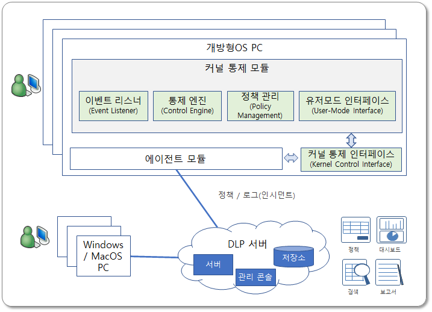

개방형OS에서의 엔드포인트 정보유출방지(Endpoint DLP) 보안 소프트웨어
===================================

프로젝트 소개
-------------------
본 오픈소스 프로젝트는 개방형OS 환경에서 정보유출방지 기능을 제공하기 위한 보안 소프트웨어입니다. 정보유출방지(DLP, Data Loss Prevention)는 조직내 기밀정보가 외부로 유출되는 것을 방지하는 정보보호 솔루션이며, 디바이스에 저장된 기밀정보를 검출하거나, 이동식 저장매체 또는 출력물, 네트워크 전송을 통해 유출되는 기밀정보를 탐지하여 조직의 자산을 보호할 수 있습니다.

프로젝트 기여하기
--------------------
프로젝트에는 다음의 방법으로 참여할 수 있습니다.
* 버그 리포트
* 수정사항 제출
* 새로운 기능 제안
* 문서
* 자세한 내용은 [Contributing Guide](https://github.com/SomansaOpenSource/endpointdlp/blob/master/CONTRIBUTUNG.md)를 참고하시기 바랍니다.

프로젝트 정보
----------
* 개발 언어: C
* 개발 환경: VSCode
* 라이선스: Apache 2.0
* 문의사항: 소만사 이상진 수석연구원(sjinlee@somansa.com)

Getting Started
=================
업데이트 예정
